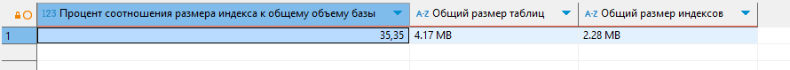
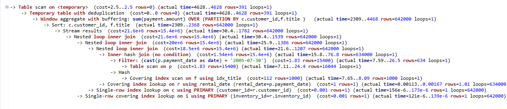
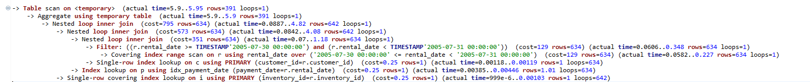

# Домашнее задание к занятию "`Индексы`" - `Барышков Михаил`

## Задание 1

Напишите запрос к учебной базе данных, который вернёт процентное отношение общего размера всех индексов к общему размеру всех таблиц.

---

## Решение 1

```sql
SELECT
 ROUND(SUM(index_length) / SUM(data_length + index_length) * 100, 2) AS "процентное отношение размера индексов к общему размеру (данные + индексы)",
 CONCAT(ROUND(SUM(data_length) / (1024 * 1024), 2), ' MB') AS "Общий размер таблиц",
 CONCAT(ROUND(SUM(index_length) / (1024 * 1024), 2), ' MB') AS "Общий размер индексов"
FROM
 information_schema.TABLES
WHERE
 table_schema = 'sakila';
```



Этот запрос:

1. Считает общий размер данных (data_length) и общий размер индексов (index_length) для всех таблиц в схеме 'sakila'Вычисляет процентное отношение размера индексов к общему размеру (данные + индексы)

2. Также предоставляет информацию об общем размере таблиц и индексов в мегабайтах для наглядности

3. Результат покажет, какую часть от общего размера базы данных занимают индексы, что помогает оценить эффективность их использования.

---

## Задание 2

Выполните explain analyze следующего запроса:

```sql
select distinct concat(c.last_name, ' ', c.first_name), sum(p.amount) over (partition by c.customer_id, f.title)
from payment p, rental r, customer c, inventory i, film f
where date(p.payment_date) = '2005-07-30' and p.payment_date = r.rental_date and r.customer_id = c.customer_id and i.inventory_id = r.inventory_id
```

- перечислите узкие места;
- оптимизируйте запрос: внесите корректировки по использованию операторов, при необходимости добавьте индексы.

---

## Решение 2

```sql
EXPLAIN ANALYZE
SELECT
 DISTINCT concat(c.last_name, ' ', c.first_name),
 sum(p.amount) OVER (PARTITION BY c.customer_id,
 f.title)
FROM
 payment p,
 rental r,
 customer c,
 inventory i,
 film f
WHERE
 date(p.payment_date) = '2005-07-30'
 AND p.payment_date = r.rental_date
 AND r.customer_id = c.customer_id
 AND i.inventory_id = r.inventory_id;
```



### Узкие места в исходном запросе

1. Использование **DATE()** в условии **WHERE** - функция **DATE(p.payment_date)** предотвращает использование индекса по **payment_date**

2. Отсутствие явного **JOIN** синтаксиса - неявные соединения через запятую сложнее читать и оптимизировать

3. Избыточные соединения - таблица **film** подключена, но не используется в фильтрации

4. Оконная функция с избыточным **PARTITION BY** - разделение по **customer_id** и **film.title** создает много мелких групп

5. **DISTINCT** с оконной функцией - может создавать дубликаты, которые затем удаляются

### Оптимизированный запрос

```sql
-- Создаем индекс для payment_date, если его нет
CREATE INDEX idx_payment_date ON payment(payment_date);

-- Оптимизированный запрос
EXPLAIN ANALYZE
SELECT 
    CONCAT(c.last_name, ' ', c.first_name) AS customer_name,
    SUM(p.amount) AS total_payment
FROM 
    payment p
    JOIN rental r ON p.payment_date = r.rental_date
    JOIN customer c ON r.customer_id = c.customer_id
    JOIN inventory i ON r.inventory_id = i.inventory_id
WHERE 
    p.payment_date >= '2005-07-30' 
    AND p.payment_date < '2005-07-31'
GROUP BY 
    c.customer_id, c.last_name, c.first_name;
```



### Ключевые улучшения

1. Замена **DATE()** на диапазон дат - позволяет использовать индекс по **payment_date**

2. Явные **JOIN** вместо неявных - улучшает читаемость и контроль над порядком соединений

3. Упрощение логики агрегации - замена оконной функции на **GROUP BY**

4. Удаление избыточных соединений - убрана таблица **film**, которая не использовалась для фильтрации

5. Удаление **DISTINCT** - больше не нужен, так как **GROUP BY** обеспечивает уникальность

### Дополнительные рекомендации

1. Если часто нужны запросы по дате платежа, можно создать составной индекс:

```sql
CREATE INDEX idx_payment_date_customer ON payment(payment_date, customer_id);
```

2. Для большей производительности можно рассмотреть материализованное представление, если данные часто запрашиваются, но редко изменяются.

3. Если нужно сохранить информацию о фильмах, можно добавить их в запрос после оптимизации основной части.

## Дополнительные задания (со звёздочкой*)

Эти задания дополнительные, то есть не обязательные к выполнению, и никак не повлияют на получение вами зачёта по этому домашнему заданию. Вы можете их выполнить, если хотите глубже шире разобраться в материале.

### Задание 3*

Самостоятельно изучите, какие типы индексов используются в PostgreSQL. Перечислите те индексы, которые используются в PostgreSQL, а в MySQL — нет.

*Приведите ответ в свободной форме.*

---

## Решение 3

### Типы индексов в PostgreSQL, отсутствующие в MySQL

**PostgreSQL** предлагает более разнообразные типы индексов по сравнению с **MySQL**. Вот основные типы, которые есть в **PostgreSQL**, но отсутствуют в **MySQL**:

1. Частичные индексы **(Partial Indexes)** Позволяют индексировать только часть данных таблицы, соответствующую условию **WHERE**

```sql
CREATE INDEX idx_customer_active ON customer (last_name) WHERE active = TRUE;
```

2. Функциональные индексы **(Expression Indexes)** Индексы по результатам вычисления выражений или функций

```sql
CREATE INDEX idx_name_lower ON customer (lower(last_name));
```

3. **GIN (Generalized Inverted Index)** Оптимизирован для работы с составными значениями (массивы, **JSON**, полнотекстовый поиск) Особенно эффективен для операторов **@>, <@, ?, ?|, ?&**

4. **GiST (Generalized Search Tree)** Поддерживает геопространственные данные и сложные типы данных. Используется для индексации геометрических объектов, IP-адресов, полнотекстового поиска

5. **SP-GiST (Space-Partitioned GiST)** Оптимизирован для неоднородных данных с естественным разделением пространства. Полезен для индексации точек, прямоугольников, IP-адресов

6. **BRIN (Block Range INdex)** Эффективен для очень больших таблиц с коррелированными данными. Работает с диапазонами блоков данных, а не отдельными строками

```sql
CREATE INDEX idx_payment_date_brin ON payment USING brin (payment_date);
```

7. **Hash-индексы** (хотя в **MySQL 8.0+** появились, но работают иначе). В **PostgreSQL** они более функциональны и поддерживают транзакционность

8. Индексы для пользовательских типов данных. **PostgreSQL** позволяет создавать индексы для пользовательских типов данных и операторов

9. Индексы по нескольким столбцам с разными сортировками

```sql
CREATE INDEX idx_multicol ON table (col1 ASC, col2 DESC);
```

10. Индексы с включенными столбцами **(INCLUDE)**. Позволяют включать дополнительные столбцы в индекс без их использования в дереве индекса

```sql
CREATE INDEX idx_customer_include ON customer (last_name) INCLUDE (first_name, email);
```

Эти типы индексов делают **PostgreSQL** особенно мощным для сложных сценариев использования, таких как полнотекстовый поиск, геопространственные данные и работа с неструктурированными данными **(JSON)**.